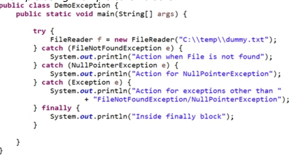
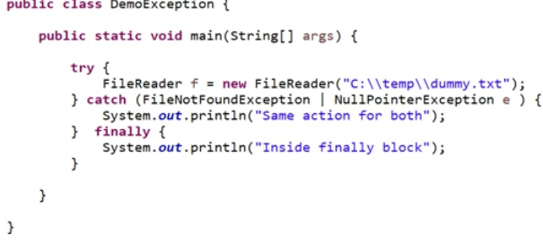

# Pregunta 1: ¿Cuáles son los 4 pilares de la POO?
Respuesta: Los 4 pilares de la POO son:

1. #Abstracción
2. #Encapsulación
3. #Herencia
4. #Polimorfismo
Veámoslos:

---
## 1. Abstracción: 
La abstracción es un proceso que oculta los detalles de la implementación y muestra solo la funcionalidad al usuario.
Ejemplos del mundo real:
- Control remoto del televisor: Para encender el televisor, hay que presionar el botón de encendido; no es necesario conocer las operaciones del circuito interno, como el paso de las ondas infrarrojas.
- Cambio de marchas del coche: Sabemos qué sucede al cambiar de marcha. Pero no sabemos cómo funciona el cambio de marchas internamente; esa información es irrelevante para nosotros, por lo que se abstrae.
En Java, la abstracción se puede lograr de dos maneras:
- Clases abstractas
- Interfaces
## 2. Encapsulación: 
La encapsulación es un proceso de vinculación de datos y métodos dentro de una clase. Piénselo como mostrar los detalles esenciales de una clase mediante el uso de modificadores de control de acceso (público, privado, protegido). Por lo tanto, podemos decir que la encapsulación conduce al nivel de abstracción deseado.

Ejemplo: Java Bean, donde todos los miembros de datos se hacen privados y se definen ciertos métodos públicos para que el mundo exterior pueda acceder a ellos.
## 3. Herencia: 
Usar la herencia significa definir una relación padre-hijo entre clases. De esta manera, se puede reutilizar el código ya definido en la clase padre. La reutilización del código es la mayor ventaja de la herencia.
Java no permite la herencia múltiple a través de clases, pero sí a través de interfaces.
## 4. Polimorfismo:
Poli significa muchos y Morf significa formas. El polimorfismo es el proceso mediante el cual un objeto o función adopta diferentes formas. Existen dos tipos de polimorfismo:
- Polimorfismo en tiempo de compilación (sobrecarga de métodos)
- Polimorfismo en tiempo de ejecución (sobreescritura de métodos)
En la sobrecarga de métodos, dos o más métodos de una clase tienen el mismo nombre, pero diferentes argumentos.
Se denomina polimorfismo en tiempo de compilación porque en tiempo de compilación se decide qué método sobrecargado se llamará.
La sobreescritura se produce cuando dos métodos tienen el mismo nombre y los mismos parámetros en la clase principal y la secundaria.
Mediante la sobreescritura, la clase secundaria puede proporcionar una implementación específica para el método ya definido en la clase principal.

---
# Pregunta 2: ¿Qué es una clase abstracta?

Respuesta: Una clase que se declara con la palabra clave "abstract" se conoce como clase abstracta. Puede tener métodos abstractos (métodos sin cuerpo) y métodos concretos (métodos con cuerpo).
Algunos puntos a recordar:
- Una clase abstracta no se puede instanciar, lo que significa que no se permite crear un objeto de la clase abstracta. Esto también significa que una clase abstracta no tiene utilidad a menos que sea extendida por otra clase.
- Si hay algún método abstracto en una clase, esta debe declararse como abstracta.
- La primera clase no abstracta que extienda de una clase abstracta deberá implementar los métodos abstractos definidos en la clase abstracta.

---
# Pregunta 3: ¿Tiene una clase abstracta un constructor?

Respuesta: Esta es una pregunta frecuente en entrevistas, y la respuesta es: Sí, las clases abstractas tienen un constructor. Puedes proporcionarlo o Java proporcionará el predeterminado. Ahora bien, te estarás preguntando: si no puedes crear un objeto de una clase abstracta, ¿para qué sirve un constructor?
Algo que debes saber es que los constructores se utilizan al crear un objeto de una clase para inicializar los datos de esa clase, y tu clase abstracta puede tenerlos.

Ahora bien, cuando tu clase extiende una clase abstracta, esta se convierte en la superclase de la clase que la extiende. Recuerda que, cuando tienes un constructor de tu clase, la primera línea del constructor siempre es una llamada al constructor de la superclase, y en este momento se invoca el constructor de tu clase abstracta.

---
# Pregunta 4: ¿Qué es una interfaz?
Respuesta:

- Una interfaz en Java es el plano de una clase. Tiene constantes estáticas y métodos abstractos.
- Una interfaz especifica lo que una clase debe hacer, pero no cómo hacerlo.
- Una interfaz es como definir un contrato que se cumple implementando clases.
- Una interfaz se utiliza para lograr una abstracción completa.
- Todos los métodos de una interfaz son públicos y abstractos por defecto, y todas las variables declaradas en una interfaz son constantes: públicas, estáticas y finales.
- Una clase que implementa una interfaz deberá proporcionar la implementación de todos los métodos definidos en ella.
- Una clase puede implementar más de una interfaz; así es como Java permite la herencia múltiple.
- Desde Java 8, podemos tener métodos predeterminados y estáticos en una interfaz.

---
# Pregunta 5: Diferencia entre clase abstracta e interfaz. Respuesta: Las diferencias son: 
- Una clase abstracta puede tener métodos abstractos y concretos, pero una interfaz solo puede tener métodos abstractos (a partir de Java 8, también puede tener métodos predeterminados y estáticos).
- Los métodos de una clase abstracta pueden tener modificadores de acceso distintos de los públicos, pero los métodos de interfaz son implícitamente públicos y abstractos.
- Una clase abstracta puede tener variables finales, no finales, estáticas y no estáticas, pero las variables de interfaz solo son estáticas y finales.
- Una subclase solo puede extender una clase abstracta, pero puede implementar múltiples interfaces.
- Una clase abstracta puede extender otra clase e implementar múltiples interfaces, pero una interfaz solo puede extender otras interfaces.
En esta pregunta, el entrevistador podría intentar confundirte diciendo que, a partir de Java 8, se pueden tener métodos estáticos y predeterminados en una interfaz. Entonces, ¿cuál es la diferencia entre una clase abstracta y una interfaz? La respuesta que deberías dar es: Todavía podemos extender solo una clase, pero podemos implementar múltiples. interfaces.

---
# Pregunta 6: ¿Qué elegir: interfaz o clase abstracta? Respuesta: Considere estos puntos al elegir entre ambas: 
- Si desea proporcionar una implementación predeterminada para algunos de los métodos comunes que las subclases pueden usar directamente, puede usar una clase abstracta, ya que también puede tener métodos concretos. Esto no ocurre con la interfaz, ya que las clases hija que la implementan deberán proporcionar la implementación de todos los métodos declarados en ella.
- Si su contrato cambia constantemente, la interfaz creará problemas, ya que deberá proporcionar la implementación de esos nuevos métodos en todas las clases que la implementan, mientras que con la clase abstracta puede proporcionar una implementación predeterminada para los nuevos métodos y solo cambiar las clases que realmente los usarán.
En la mayoría de los casos, las interfaces son una buena opción. También es una de las mejores prácticas al codificar en términos de interfaces.

---
# Pregunta 7: ¿Por qué Java 8 introdujo métodos predeterminados?

Respuesta: Para ampliar la capacidad de una interfaz ya existente, Java 8 introdujo métodos predeterminados. Veamos esto con un ejemplo: Supongamos que hay 100 clases que implementan una interfaz. Ahora desea definir un nuevo método dentro de su interfaz. En este caso, deberá modificar todas las clases de implementación para cumplir con el contrato de interfaz. Java introdujo métodos predeterminados. Aquí puede proporcionar la implementación predeterminada de ese nuevo método dentro de su interfaz. Como no es obligatorio que las clases implementadoras proporcionen la implementación de los métodos predeterminados, las 100 clases pueden usar la implementación predeterminada o, si lo desean, pueden proporcionar su propia implementación sobrescribiendo el método predeterminado.
Ahora considere un escenario interesante: Tiene dos interfaces, Interface1 e Interface2, ambas con el método predeterminado hello(), y una clase implementa estas dos interfaces sin implementar este método predeterminado. ¿Ve el problema? Sí, es el famoso problema del diamante (Consulta la pregunta 9 si aún no estás familiarizado con este problema).

Por lo tanto, para evitar este error, es obligatorio proporcionar una implementación para los métodos predeterminados comunes de las interfaces.

# Pregunta 8: ¿Por qué Java 8 introdujo métodos estáticos?
Respuesta: Considere un ejemplo donde desea definir una clase de utilidad. Lo que normalmente se hace es definir una clase que contiene métodos estáticos y luego llamar a estos métodos usando el nombre de la clase. Ahora, a partir de Java 8, se puede hacer lo mismo usando una interfaz, proporcionando solo métodos estáticos dentro de ella. Esta forma de usar la interfaz para definir clases de utilidad es mejor, ya que también mejora el rendimiento, ya que usar una clase es una operación más costosa que usar una interfaz.

# Pregunta 9: ¿Por qué Java no permite la herencia múltiple?
Respuesta: La herencia múltiple ocurre cuando una clase tiene más de una clase padre.

¿Por qué Java no permite esto? Supongamos que dos clases padre tienen un método llamado hello() con la misma firma y una clase hija extiende estas dos clases. Si se llama a este método hello(), que es el mismo en ambas clases padre, ¿qué método de la clase padre se ejecutará? Esto genera una situación ambigua, también conocida como el Problema del Diamante.
Se obtendrá un error de compilación si se intenta extender más de una clase.

# Pregunta 10: ¿Cuáles son las reglas para la sobrecarga y la sobre escritura de métodos?
Respuesta: Reglas de sobrecarga de métodos: Dos métodos pueden considerarse sobrecargados si cumplen las siguientes reglas:

- Ambos tienen el mismo nombre de método
- Ambos tienen argumentos diferentes
Si ambos métodos cumplen las dos reglas anteriores, pueden o no:
- Tener diferentes modificadores de acceso
- Tener diferentes tipos de retorno
- Lanzar diferentes excepciones marcadas o no marcadas
Reglas de anulación de métodos: El método de anulación de la clase hija debe cumplir las siguientes reglas:
- Debe tener el mismo nombre de método que el método de la clase padre
- Debe tener los mismos argumentos que el método de la clase padre
- Debe tener el mismo tipo de retorno o un tipo de retorno covariante (las clases hijas son tipos covariantes con respecto a sus clases madres)
- No debe lanzar excepciones marcadas más amplias
- No debe tener un modificador de acceso más restrictivo (si el método padre es público, el método hijo no puede ser privado/protegido)

# Pregunta 11: ¿Podemos sobrescribir los métodos finales? 
Respuesta: No, los métodos finales no se pueden sobrescribir.

# Pregunta 12: ¿Se pueden sobrescribir los constructores y los métodos privados?
Respuesta: No

# Pregunta 13: ¿Qué es la palabra clave final y dónde se puede utilizar?

Respuesta: Si se usa final con una variable de tipo primitivo, su valor no se puede modificar una vez asignado.
Si se usa final con un método, no se puede sobrescribir en la subclase.
Si se usa final con una clase, esta no se puede extender.
Si se usa final con un tipo de objeto, no se puede volver a referenciar a ese objeto.

# Pregunta 14: ¿Qué es una excepción y el manejo de excepciones?

Respuesta: Una excepción es un evento que interrumpe el flujo normal del programa. Es un objeto que se lanza en tiempo de ejecución, por lo que el manejo de excepciones es un mecanismo mediante el cual se mantiene el flujo normal del programa.

# Pregunta 15: Diferencia entre error y excepción. 
Respuesta: Error: Los errores en un programa son irrecuperables; indican que algo grave ha fallado en la aplicación y el programa se termina si ocurre un error, por ejemplo, quedarse sin memoria (OutOfMemoryError), realizar demasiadas llamadas recursivas (StackOverflowError), etc.
Excepción: Las excepciones, por otro lado, son algo que podemos recuperar gestionándolas adecuadamente, por ejemplo:
Intentar acceder a una propiedad o método desde un objeto nulo:

NullPointerException; dividir un entero entre cero:
ArithmeticException; etc.

# Pregunta 16: ¿Cuáles son los diferentes tipos de excepciones?
Respuesta: Hay dos tipos de excepciones:
- Excepciones comprobadas: Todas las excepciones, excepto RuntimeException y Error, se conocen como excepciones comprobadas. Estas excepciones son comprobadas por el compilador durante la compilación. Por ejemplo, al intentar leer un archivo, el compilador nos obliga a gestionar la excepción FileNotFoundException porque es posible que el archivo no esté presente. Otras excepciones comprobadas son SQLException, IOException, etc.
- Excepciones no comprobadas: Las excepciones en tiempo de ejecución se conocen como excepciones no comprobadas. El compilador no nos obliga a gestionar estas excepciones, pero como programadores, es nuestra responsabilidad gestionar las excepciones en tiempo de ejecución, como NullPointerException, ArithmeticException, ArrayIndexOutOfBoundException, etc.

# Pregunta 17: ¿Cómo se manejan las excepciones en Java?

Respuesta: El bloque try-catch se utiliza para la gestión de excepciones. Si cree que ciertas sentencias pueden generar una excepción, rodéelas con el bloque try.
Un bloque try siempre va seguido de un bloque catch, finalmente, o ambos.
No se puede usar el bloque try solo:

# Pregunta 18: ¿Podemos escribir un bloque try sin un bloque catch?

Respuesta: Sí, podemos escribir un bloque try con finally, pero no podemos escribir un bloque try solo.

# Pregunta 19: ¿Cómo gestionar múltiples excepciones juntas?
Respuesta: Puede escribir varios bloques catch uno tras otro para cada excepción o escribir un solo bloque catch usando una barra vertical (|) para separar las excepciones.
Al escribir varios bloques catch, debe seguir la siguiente regla:

Manejar la excepción más específica y luego pasar a las más genéricas. Esto significa que no puede manejar la excepción (clase base de la excepción) antes de FileNotFoundException.
Suppose, your method is throwing more than one exception
and you want to perform some specific action based on the
exception thrown, you should use multiple catch blocks in
this case.

Example using multiple catch blocks:

Al utilizar el símbolo de barra vertical (|):

# QPregunta 20: ¿Cuándo no se ejecuta el bloque "finally"? Respuesta:

- Cuando se llama a System.exit()
- cuando la JVM falla
