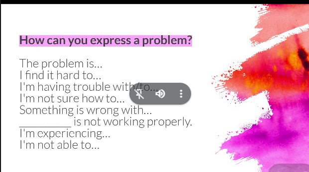

## Part of email
* A subject line
* Greeting
* Opening line
* Makin a request

Subject: Meeting for today at 2:00 pm 

Good morning Juliana

I couldn't join the meeting today.

Could we are meet tomorrow at 8:00 am?

Thank you for the time, 

Javier.

Incapacidad medica: **sick leave**

